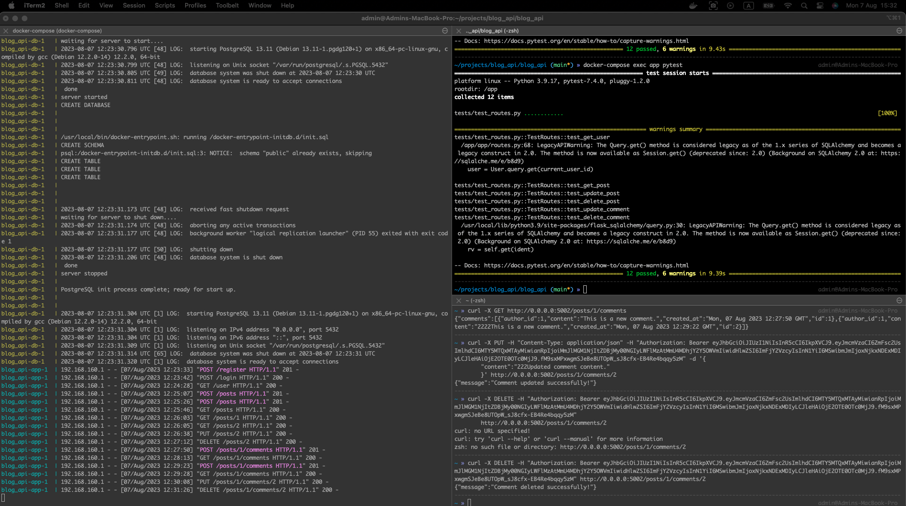

# Flask Auth Blog Application

This is a simple Flask auth blog application that provides basic autentification functionality and GRUD operations for posts and commets.

## Installation

1. Clone the repository to your local machine:

```bash
git clone git@github.com:VladyslavHnatchenko/flask-auth-blog-app.git
cd flask-calculator-app/blog_api
```

## Docker Build and Up

```bash
docker-compose up --build
```

## Running tests via Pytest 

```bash
docker-compose exec app pytest
```

## Testing CRUD API
You can test the application using [curl](https://curl.se/) or any other API testing tool. All routes are defined in routes.py.
For example, to test user registration, you can use the following command:

```bash
curl -X POST -H "Content-Type: application/json" -d '{
"username":"LocalUser",
"email":"localuser@example.com",
"password":"password"
}' http://0.0.0.0:5002/register
```

